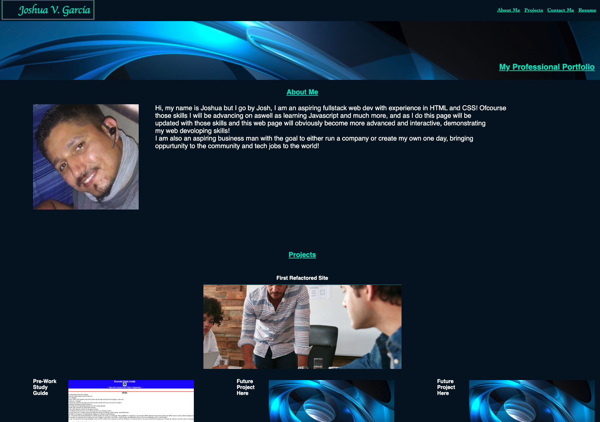

# challenge-2

I created a portfolio based on the user story and acceptance criteria below to complete this challenge.

## Link 
Click the link to view my portfolio:
[Portfolio](https://garciajv86.github.io/Portfilio/)



## Description
This website is a starter portfolio for me to build on or even recreate later in the future once I have the tools and the knowledge to do so. When you first enter the site you will be presented with my name and the content of the page. To the top right of the page is a navigation bar that can be clicked to take the user to the corresponding section on the page. As of right now I do have a resume navigation that at the moment isn't functional seeing as I do not yet have a resume to upload just yet. Also I did adjust for two different screen sizes giving 3 different screen size looks if you include the normal desktop look. Also under projects is a list of my projects, these images are clickable and will direct the user to my projects websites to further view if they choose. This web application is a responsive web application and will adjust to different screen sizes. Also if you go to the contact section and click on the word GitHub it will take you to my GitHub profile on GitHub.

## User Story

```
AS AN employer
I WANT to view a potential employee's deployed portfolio of work samples
SO THAT I can review samples of their work and assess whether they're a good candidate for an open position
```


## Acceptance Criteria

```
GIVEN I need to sample a potential employee's previous work
WHEN I load their portfolio
THEN I am presented with the developer's name, a recent photo or avatar, and links to sections about them, their work, and how to contact them
WHEN I click one of the links in the navigation
THEN the UI scrolls to the corresponding section
WHEN I click on the link to the section about their work
THEN the UI scrolls to a section with titled images of the developer's applications
WHEN I am presented with the developer's first application
THEN that application's image should be larger in size than the others
WHEN I click on the images of the applications
THEN I am taken to that deployed application
WHEN I resize the page or view the site on various screens and devices
THEN I am presented with a responsive layout that adapts to my viewport
```

## Features
This site has a clickable navigation menu to take user's to the corresponding sections.
This site has clickable image's to take user's to the deployed projects site.
This site has a contact section and in that section there is a clickable word GitHub that takes the user to my github profile
This site has responsive design.